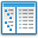

#  FileTags Library

FileTags Library - a library written in assembler (for x86 and x64) which consists of functions that wrap the COM implementation of the [IPropertyStore](https://learn.microsoft.com/en-us/windows/win32/api/propsys/nn-propsys-ipropertystore) object, for for accessing the [PKEY_Keywords](https://learn.microsoft.com/en-us/windows/win32/properties/props-system-keywords) property metadata of a file. 

The `IPropertyStore` object and `PKEY_Keywords` property is used for the 'Tags' feature in Windows Explorer, when viewing the properties of a file, or when the Details Pane of Windows Explorer is open and a file is selected.

Thus the FileTags Library functions hide the complexities of interacting with the `IPropertyStore` COM object, allowing the user to read, write and clear the keywords / tags for a file.

[](http://www.masm32.com/download.htm) [](http://www.terraspace.co.uk/uasm.html) [![](https://img.shields.io/badge/RadASM%20-v2.2.2.x%20-red.svg?style=flat-square&colorB=C94C1E&logo=data:image/png;base64,iVBORw0KGgoAAAANSUhEUgAAABQAAAAgCAYAAAASYli2AAACcklEQVR42tWVXWiPURzHz/FyQZOiVuatuFEoKzfKSCs35EJeCqFcEEa5s2heNrXiApuXFDYveUlKSywlIRfczM0WjZvJlGKTRLb5fHvOU6fT+T/PY3bj1Kff8z8vn+f8znPO+dshihnBYv8L4awRcl2FRTarBy8bQzgEjdbabzl9nxCW2IwOFYTrsBTKEH7PET4lLLYlGpcTrkC5qxqL8HeO8CVhoQ0qRxMOw34Y5TVVIPyYI+whTLVehZ9iWgZAL1mN8G6GbArhA/TZEilqKx2HCbADXkAV0oESwhOEfdChbXOUh1ovxS+wlcH3aNvC82VX3wx7Qyl9NhEugXZEU7ixX8E6Br13nTVDPU927R3QCl0wTX2h2rUNQqUv/ATLkHUGM1hLuBF8pFipZ+zBcIZKpw1O0vjYk24mnIXxEZHGNMIBxgxJ2M2P2PF7DafhGh1/0G8Gzzv1cWASfIZn0EJ7VzpIQqWyUguulFUXiDXwApxhYE9O2ibc2PMJNbAxkp5Oyh3NGvHzQkJPrK/aANtLjNNuOAU3kf/KFTrpGsJtaIdxbu3C0gvn4Dzi3qLCI3Su4/cCnnfDBvcCv/yEW0a7o6gwWI5tJvniMwutYZbQa9elsUqzgun/JKStjKAzvAvmDXuG1M1xqerkTAyG6Cy3FREeM8k2kag6MomvcBGaefG7LOF6k1wK6SUbFl0iOpqt/v+NjYjmEva4NQpPi9K6b5JN/UiXQTg+vbF1nlc4USytPpNcok1Iuk1G0eWgS0Hnd3akXbeIbuqWvP9lXxhOW2k9cOvzMJZWUWG/Sf4/lNbbv5GEwjeSSIaof7iitPwBoSgbVud1Jo0AAAAASUVORK5CYII=)](http://www.softpedia.com/get/Programming/File-Editors/RadASM.shtml) [](https://filedialog-library.readthedocs.io/en/latest/index.html)

# Features

* Read file tags: `FileTagsReadA` & `FileTagsReadW`
* Write file tags: `FileTagsWriteA` & `FileTagsWriteW`
* Clear file tags: `FileTagsClearA` & `FileTagsClearW`

# Download

* Download the latest release for whichever assembler and architecture you require:
  
  - [FileTags-x86.zip](https://github.com/mrfearless/FileTags-Library/blob/master/releases/FileTags-x86.zip?raw=true)
  - [FileTags-x64.zip](https://github.com/mrfearless/FileTags-Library/blob/master/releases/FileTags-x64.zip?raw=true)

* Copy `FileTags.inc` to your `masm32\include` folder for FileTags Library x86, or `uasm\include` for FileTags Library x64 (or wherever your include files are located)

* Copy `FileTags.lib` to your `masm32\lib` folder for FileTags Library x86, or `uasm\lib\x64` for FileTags Library x64 (or wherever your libraries are located)

* Add the following to your project:
  
  ```assembly
  include FileTags.inc
  includelib FileTags.lib
  ```

# Functions

Documentation on the functions in the FileTags libraries are located on readthedocs [here](https://filetags-library.readthedocs.io/en/latest/index.html)

# Resources

For more details on file tagging or the file property metadata:

* [https://karl-voit.at/2019/11/26/Tagging-Files-With-Windows-10/](https://karl-voit.at/2019/11/26/Tagging-Files-With-Windows-10/)
* [https://github.com/Dijji/FileMeta/wiki/XP,-Vista-and-File-Metadata](https://github.com/Dijji/FileMeta/wiki/XP,-Vista-and-File-Metadata)

Included with the releases are additional RadASM autocomplete / intellisense type files. Each `*.api.txt` file contains instructions as to where to paste their contents. 

Other resources may be required to build the libraries:

- [RadASM IDE](http://www.softpedia.com/get/Programming/File-Editors/RadASM.shtml)
- [MASM32 SDK](http://www.masm32.com/download.htm)
- [UASM - x86/x64 assembler](http://www.terraspace.co.uk/uasm.html)
- [WinInc - include files for x64 assembler](http://www.terraspace.co.uk/WinInc209.zip)
- [UASM-with-RadASM](https://github.com/mrfearless/UASM-with-RadASM)
